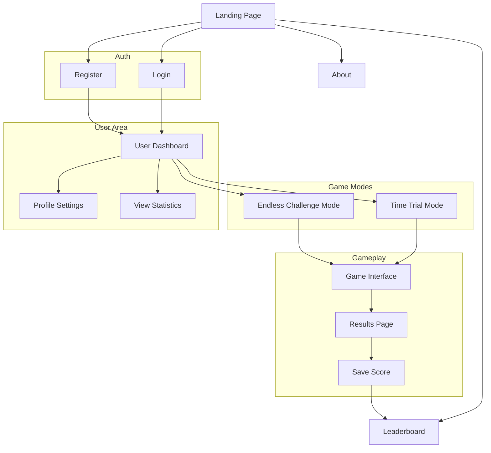

# MathMaster

MathMaster is a quick math game designed for university students to enhance their mathematical skills. The game features two exciting game modes:

1. **Time Trial**: Race against the clock to solve as many math problems as possible within a set time limit.
2. **Endless Challenge**: Test your endurance by solving math problems until you make a mistake.

## Table of Contents

- [Project Name](#mathmaster)
- [Game Modes](#game-modes)
- [Features](#features)
- [Project Schema](#project-schema)
- [Team Members](#team-members)
- [Contributing](#contributing)

## Game Modes

### Time Trial
In Time Trial mode, players have a fixed amount of time to solve as many math problems as possible. The faster you solve, the higher your score!

### Endless Challenge
In Endless Challenge mode, players continue solving math problems until they make a mistake. The longer you can keep going without errors, the higher your score!

## Features

- **Interactive UI**: User-friendly interface for an engaging gaming experience.
- **Dynamic Difficulty**: Questions adapt to the player's skill level.
- **Leaderboard**: Compete with friends and classmates to see who can get the highest score.
- **Responsive Design**: Play on any device, from desktop to mobile.

## Project Schema

## Team Members

- [**Robbe Caerts**](https://github.com/RobbeCaerts): Fullstack Developer
- [**Valdemar Kobelis**](https://github.com/ValdemarKobelis): Fullstack Developer
- [**David Dževeckij**](https://github.com/dzeveckij): Fullstack Developer

## Contributing

Contributions are what make the open source community such an amazing place to learn, inspire, and create. Any contributions you make are **greatly appreciated**.

1. Fork the Project
2. Create your Feature Branch (`git checkout -b feature/AmazingFeature`)
3. Commit your Changes (`git commit -m 'Add some AmazingFeature'`)
4. Push to the Branch (`git push origin feature/AmazingFeature`)
5. Open a Pull Request
